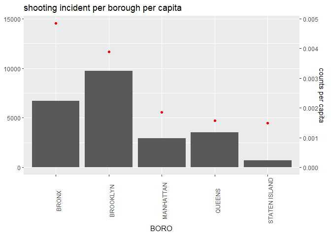
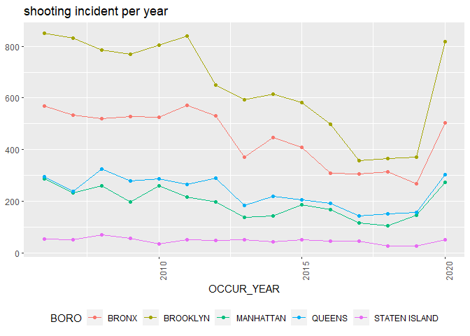
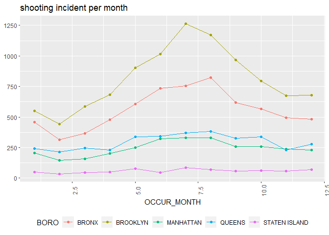
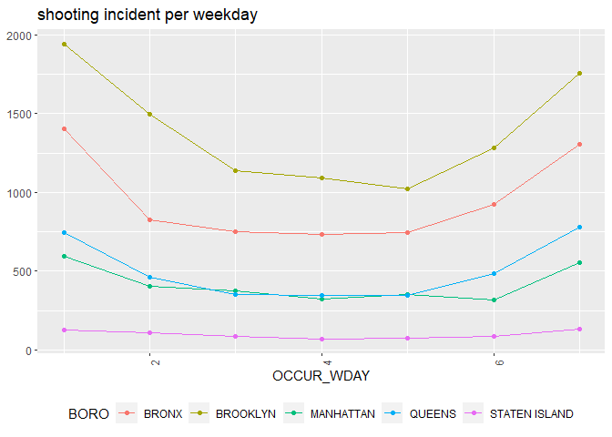
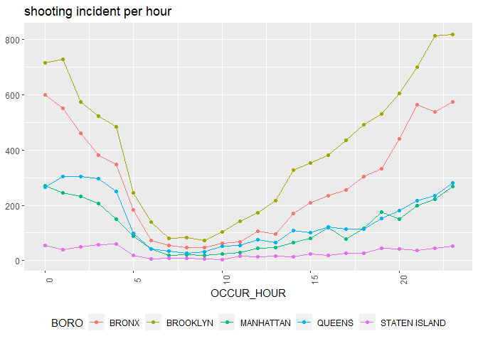
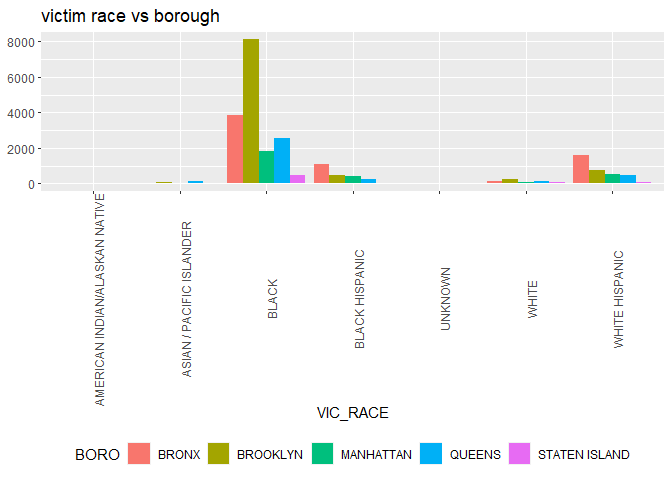
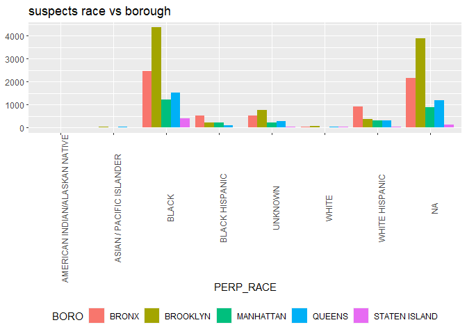
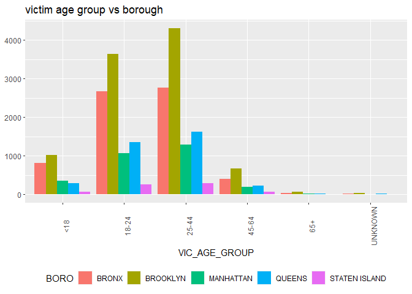
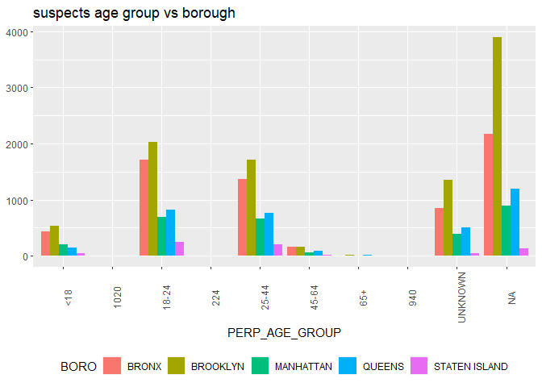

Week3 Assignment Continued
================
J. Imamura
2/13/2022

## Project Data

To access the files for the project in this module, go to
<https://catalog.data.gov/dataset> and find the dataset titled NYPD
Shooting Incident Data (Historic). Right click on the CSV button and
copy the link address. You will then put this link address into your Rmd
when you are reading in the dataset. This project will be built up over
the week and will be peer-reviewed as part of your grade at the end of
the week.

### Summary of the data

Description of the data is available here:
<https://data.cityofnewyork.us/Public-Safety/NYPD-Shooting-Incident-Data-Historic-/833y-fsy8>

And we can see that there are various information:

-   date and time
-   borough and where
-   age group, race, sex of victim and perpetrator

``` r
shooting_data <- read_csv("https://data.cityofnewyork.us/api/views/833y-fsy8/rows.csv")
population_boro <- read_csv("https://data.cityofnewyork.us/api/views/xi7c-iiu2/rows.csv")
summary(shooting_data)
```

    ##   INCIDENT_KEY        OCCUR_DATE         OCCUR_TIME           BORO          
    ##  Min.   :  9953245   Length:23585       Length:23585      Length:23585      
    ##  1st Qu.: 55322804   Class :character   Class1:hms        Class :character  
    ##  Median : 83435362   Mode  :character   Class2:difftime   Mode  :character  
    ##  Mean   :102280741                      Mode  :numeric                      
    ##  3rd Qu.:150911774                                                          
    ##  Max.   :230611229                                                          
    ##                                                                             
    ##     PRECINCT      JURISDICTION_CODE LOCATION_DESC      STATISTICAL_MURDER_FLAG
    ##  Min.   :  1.00   Min.   :0.000     Length:23585       Mode :logical          
    ##  1st Qu.: 44.00   1st Qu.:0.000     Class :character   FALSE:19085            
    ##  Median : 69.00   Median :0.000     Mode  :character   TRUE :4500             
    ##  Mean   : 66.21   Mean   :0.333                                               
    ##  3rd Qu.: 81.00   3rd Qu.:0.000                                               
    ##  Max.   :123.00   Max.   :2.000                                               
    ##                   NA's   :2                                                   
    ##  PERP_AGE_GROUP       PERP_SEX          PERP_RACE         VIC_AGE_GROUP     
    ##  Length:23585       Length:23585       Length:23585       Length:23585      
    ##  Class :character   Class :character   Class :character   Class :character  
    ##  Mode  :character   Mode  :character   Mode  :character   Mode  :character  
    ##                                                                             
    ##                                                                             
    ##                                                                             
    ##                                                                             
    ##    VIC_SEX            VIC_RACE           X_COORD_CD        Y_COORD_CD    
    ##  Length:23585       Length:23585       Min.   : 914928   Min.   :125757  
    ##  Class :character   Class :character   1st Qu.: 999925   1st Qu.:182539  
    ##  Mode  :character   Mode  :character   Median :1007654   Median :193470  
    ##                                        Mean   :1009379   Mean   :207300  
    ##                                        3rd Qu.:1016782   3rd Qu.:239163  
    ##                                        Max.   :1066815   Max.   :271128  
    ##                                                                          
    ##     Latitude       Longitude        Lon_Lat         
    ##  Min.   :40.51   Min.   :-74.25   Length:23585      
    ##  1st Qu.:40.67   1st Qu.:-73.94   Class :character  
    ##  Median :40.70   Median :-73.92   Mode  :character  
    ##  Mean   :40.74   Mean   :-73.91                     
    ##  3rd Qu.:40.82   3rd Qu.:-73.88                     
    ##  Max.   :40.91   Max.   :-73.70                     
    ## 

------------------------------------------------------------------------

## Tweak data for further investigation

I’d like to look in detail about “when” the incident occured. To split
into YMDhms, I firstly mutated string to dates

``` r
shooting_data <- shooting_data %>%
                   mutate(OCCUR_DATE=mdy(OCCUR_DATE))
```

------------------------------------------------------------------------

## Visualize data

### Overview

Let’s see which borough is the worst safety. I took population info.

``` r
population_boro <- population_boro %>% 
                      group_by(Borough) %>% 
                      summarize(`Population`=sum(`2010 Population`)) %>%
                      rename(BORO = "Borough") %>%
                      mutate(BORO = toupper(BORO))
```

And then joined into the original data. We can see that Bronx is the
worst safety area in terms of the number of incidents per capita.

``` r
shooting_data %>%
    group_by(BORO) %>%
    summarize(count = n()) %>%
    left_join(population_boro, by="BORO") %>%
    mutate(shoot_per_capita = count/Population) %>%
    ggplot(aes(x=BORO, y=count)) +
    geom_bar(stat="identity") +
    geom_point(aes(x=BORO, y=shoot_per_capita*3000000), colour="red") +
    scale_y_continuous(sec.axis=sec_axis(~(./3000000), name="counts per capita")) +
    theme(legend.position = "bottom", axis.text.x=element_text(angle=90)) +
    labs(title = "shooting incident per borough per capita", y = NULL)
```

<!-- -->

### Location vs Time

Next, let’s see time-wise incident statistics for each borough.

Below is the number of per-year incidents. As the graph suggests,
incidents are suddenly increased from 2020. I’m not an U.S. residents,
but I heard that public order is deteriorated due to COVID19. This may
show this fact.

``` r
shooting_data %>%
    mutate(OCCUR_YEAR=year(OCCUR_DATE)) %>%
    group_by(OCCUR_YEAR, BORO) %>%
    summarize(count = n()) %>%
    ggplot(aes(x=OCCUR_YEAR, y=count)) +
    geom_line(aes(color=BORO)) +
    geom_point(aes(color=BORO)) +
    theme(legend.position = "bottom", axis.text.x=element_text(angle=90)) +
    labs(title = "shooting incident per year", y = NULL)
```

    ## `summarise()` has grouped output by 'OCCUR_YEAR'. You can override using the
    ## `.groups` argument.

<!-- -->

Below is the number of per-month incidents. It looks that incidents
occur mostly in the summertime.

``` r
shooting_data %>%
    mutate(OCCUR_MONTH=month(OCCUR_DATE)) %>%
    group_by(OCCUR_MONTH, BORO) %>%
    summarize(count = n()) %>%
    ggplot(aes(x=OCCUR_MONTH, y=count)) +
    geom_line(aes(color=BORO)) +
    geom_point(aes(color=BORO)) +
    theme(legend.position = "bottom", axis.text.x=element_text(angle=90)) +
    labs(title = "shooting incident per month", y = NULL)
```

    ## `summarise()` has grouped output by 'OCCUR_MONTH'. You can override using the
    ## `.groups` argument.

<!-- -->

Below is the number of per-wday incidents. It looks that incidents occur
mostly in the weekend

``` r
shooting_data %>%
    mutate(OCCUR_WDAY=wday(OCCUR_DATE)) %>%
    group_by(OCCUR_WDAY, BORO) %>%
    summarize(count = n()) %>%
    ggplot(aes(x=OCCUR_WDAY, y=count)) +
    geom_line(aes(color=BORO)) +
    geom_point(aes(color=BORO)) +
    theme(legend.position = "bottom", axis.text.x=element_text(angle=90)) +
    labs(title = "shooting incident per weekday", y = NULL)
```

    ## `summarise()` has grouped output by 'OCCUR_WDAY'. You can override using the
    ## `.groups` argument.

<!-- -->

Below is the number of per-hour incidents. It looks that incidents occur
mostly in the nighttime

``` r
shooting_data %>%
    mutate(OCCUR_HOUR=hour(hms(OCCUR_TIME))) %>%
    group_by(OCCUR_HOUR, BORO) %>%
    summarize(count = n()) %>%
    ggplot(aes(x=OCCUR_HOUR, y=count)) +
    geom_line(aes(color=BORO)) +
    geom_point(aes(color=BORO)) +
    theme(legend.position = "bottom", axis.text.x=element_text(angle=90)) +
    labs(title = "shooting incident per hour", y = NULL)
```

    ## `summarise()` has grouped output by 'OCCUR_HOUR'. You can override using the
    ## `.groups` argument.

<!-- -->

### Location vs Demographics

Then, let’s see demographics-wise incident statistics for each borough.

Below is the statistics based on victim race. As we can see, black
people were victim for majority of the number of incidents. And
location-wise distribution is quite similar to the entire statistics
shown in the overview.

``` r
shooting_data %>%
  group_by(VIC_RACE, BORO) %>%
  summarize(count = n()) %>%
  ungroup() %>%
  ggplot(aes(x=VIC_RACE, y=count, fill=BORO)) +
  geom_bar(stat="identity", position='dodge') +
  theme(legend.position = "bottom", axis.text.x=element_text(angle=90)) +
  labs(title = "victim race vs borough", y = NULL)
```

    ## `summarise()` has grouped output by 'VIC_RACE'. You can override using the
    ## `.groups` argument.

<!-- -->

Next is the statistics based on suspects race. And basically the same
impression as above.

``` r
shooting_data %>%
  group_by(PERP_RACE, BORO) %>%
  summarize(count = n()) %>%
  ungroup() %>%
  ggplot(aes(x=PERP_RACE, y=count, fill=BORO)) +
  geom_bar(stat="identity", position='dodge') +
  theme(legend.position = "bottom", axis.text.x=element_text(angle=90)) +
  labs(title = "suspects race vs borough", y = NULL)
```

    ## `summarise()` has grouped output by 'PERP_RACE'. You can override using the
    ## `.groups` argument.

<!-- -->

Next is the statistics based on victim age group. Youngest age group has
slightly different tendency, but vast majority of the age groups has
quite similar distribution as the entire statistics.

``` r
shooting_data %>%
  group_by(VIC_AGE_GROUP, BORO) %>%
  summarize(count = n()) %>%
  ungroup() %>%
  ggplot(aes(x=VIC_AGE_GROUP, y=count, fill=BORO)) +
  geom_bar(stat="identity", position='dodge') +
  theme(legend.position = "bottom", axis.text.x=element_text(angle=90)) +
  labs(title = "victim age group vs borough", y = NULL)
```

    ## `summarise()` has grouped output by 'VIC_AGE_GROUP'. You can override using the
    ## `.groups` argument.

<!-- -->

At last, this is the statistics based on suspects age group.And
basically the same implression as above.

``` r
shooting_data %>%
  group_by(PERP_AGE_GROUP, BORO) %>%
  summarize(count = n()) %>%
  ungroup() %>%
  ggplot(aes(x=PERP_AGE_GROUP, y=count, fill=BORO)) +
  geom_bar(stat="identity", position='dodge') +
  theme(legend.position = "bottom", axis.text.x=element_text(angle=90)) +
  labs(title = "suspects age group vs borough", y = NULL)
```

    ## `summarise()` has grouped output by 'PERP_AGE_GROUP'. You can override using
    ## the `.groups` argument.

<!-- -->

------------------------------------------------------------------------

## Build Model

Here I made some model to predict which borough the incident happened
from time or demographic information.

As you can see in the table below, naive prediction is to predict all
result as the most frequent borough, BRONX. In this case, True Positive
rate will be 0.4.

``` r
shooting_data_ <- shooting_data[complete.cases(shooting_data),]
round(prop.table(table(shooting_data_$BORO)*100), digits = 2)
```

    ## 
    ##         BRONX      BROOKLYN     MANHATTAN        QUEENS STATEN ISLAND 
    ##          0.28          0.40          0.14          0.14          0.04

### Model1

#### Model1 train

In the first model, I used race/rage/sex information.

`select(c(STATISTICAL_MURDER_FLAG, BORO, PERP_AGE_GROUP, PERP_RACE, PERP_SEX, VIC_AGE_GROUP, VIC_SEX, VIC_RACE))`

``` r
set.seed(1234)
shooting_data_ <- shooting_data_ %>% 
    mutate(STATISTICAL_MURDER_FLAG = as.factor(STATISTICAL_MURDER_FLAG)) %>%
    mutate(BORO = as.factor(BORO)) %>%
    mutate(OCCUR_YEAR=year(OCCUR_DATE)) %>%
    mutate(OCCUR_MONTH=month(OCCUR_DATE)) %>%
    mutate(OCCUR_WDAY=wday(OCCUR_DATE)) %>%
    mutate(OCCUR_HOUR=hour(hms(OCCUR_TIME))) %>%
    mutate(PERP_AGE_GROUP=as.factor(PERP_AGE_GROUP)) %>%
    mutate(PERP_RACE=as.factor(PERP_RACE)) %>%
    mutate(PERP_SEX=as.factor(PERP_SEX)) %>%
    mutate(VIC_AGE_GROUP=as.factor(VIC_AGE_GROUP)) %>%
    mutate(VIC_SEX=as.factor(VIC_SEX)) %>%
    mutate(VIC_RACE=as.factor(VIC_RACE)) %>%
    select(c(STATISTICAL_MURDER_FLAG, BORO, PERP_AGE_GROUP, PERP_RACE, PERP_SEX, VIC_AGE_GROUP, VIC_SEX, VIC_RACE))
inTrain <- createDataPartition(shooting_data_$BORO, times = 1, p = 0.8, list = FALSE)
train_eval = shooting_data_[inTrain,]
test_eval = shooting_data_[-inTrain,]
```

#### Model1 predict

Result is a bit better than naiive prediction, but still not so
different. Prediction against Manhattan, Queens, Staten Island are
almost failed even in the training phase.

``` r
set.seed(1234)
DT_model <- randomForest(BORO ~., data = train_eval, keep.forest=TRUE, ntree=100, method = "response")
print(DT_model)
```

    ## 
    ## Call:
    ##  randomForest(formula = BORO ~ ., data = train_eval, keep.forest = TRUE,      ntree = 100, method = "response") 
    ##                Type of random forest: classification
    ##                      Number of trees: 100
    ## No. of variables tried at each split: 2
    ## 
    ##         OOB estimate of  error rate: 53.74%
    ## Confusion matrix:
    ##               BRONX BROOKLYN MANHATTAN QUEENS STATEN ISLAND class.error
    ## BRONX           765      735        16     14             1   0.5003266
    ## BROOKLYN        401     1767        13     22             3   0.1990027
    ## MANHATTAN       326      450        13     11             0   0.9837500
    ## QUEENS          178      595         9     20             2   0.9751244
    ## STATEN ISLAND    67      130         1      7             1   0.9951456

``` r
DT_Pred <- predict(DT_model, newdata = test_eval, type = "response")
sum(DT_Pred == test_eval$BORO)/length(DT_Pred)
```

    ## [1] 0.4635379

### Model2

#### Model2 train

In the second model, I used datetime information.

`select(c(STATISTICAL_MURDER_FLAG, OCCUR_YEAR, OCCUR_MONTH, OCCUR_WDAY, OCCUR_HOUR, BORO))`

``` r
set.seed(1234)
shooting_data_ <- shooting_data[complete.cases(shooting_data),]
shooting_data_ <- shooting_data_ %>% 
    mutate(STATISTICAL_MURDER_FLAG = as.factor(STATISTICAL_MURDER_FLAG)) %>%
    mutate(BORO = as.factor(BORO)) %>%
    mutate(OCCUR_YEAR=year(OCCUR_DATE)) %>%
    mutate(OCCUR_MONTH=month(OCCUR_DATE)) %>%
    mutate(OCCUR_WDAY=wday(OCCUR_DATE)) %>%
    mutate(OCCUR_HOUR=hour(hms(OCCUR_TIME))) %>%
    mutate(PERP_AGE_GROUP=as.factor(PERP_AGE_GROUP)) %>%
    mutate(PERP_RACE=as.factor(PERP_RACE)) %>%
    mutate(PERP_SEX=as.factor(PERP_SEX)) %>%
    mutate(VIC_AGE_GROUP=as.factor(VIC_AGE_GROUP)) %>%
    mutate(VIC_SEX=as.factor(VIC_SEX)) %>%
    mutate(VIC_RACE=as.factor(VIC_RACE)) %>%
    select(c(STATISTICAL_MURDER_FLAG, OCCUR_YEAR, OCCUR_MONTH, OCCUR_WDAY, OCCUR_HOUR, BORO))
inTrain <- createDataPartition(shooting_data_$BORO, times = 1, p = 0.8, list = FALSE)
train_eval = shooting_data_[inTrain,]
test_eval = shooting_data_[-inTrain,]
```

#### Model2 predict

Result is even better than model1. It’s not easy to conclude with this
level of accuracy, but it looks that when incident occured has some
special characteristics and this enabled correct prediction of
Manhattan, Queens, Staten Island.

``` r
set.seed(1234)
DT_model <- randomForest(BORO ~., data = train_eval, keep.forest=TRUE, ntree=100, method = "response")
print(DT_model)
```

    ## 
    ## Call:
    ##  randomForest(formula = BORO ~ ., data = train_eval, keep.forest = TRUE,      ntree = 100, method = "response") 
    ##                Type of random forest: classification
    ##                      Number of trees: 100
    ## No. of variables tried at each split: 2
    ## 
    ##         OOB estimate of  error rate: 44.96%
    ## Confusion matrix:
    ##               BRONX BROOKLYN MANHATTAN QUEENS STATEN ISLAND class.error
    ## BRONX           848      561        60     56             6   0.4461137
    ## BROOKLYN        413     1595        81    111             6   0.2769719
    ## MANHATTAN       164      316       275     41             4   0.6562500
    ## QUEENS          158      318        40    281             7   0.6504975
    ## STATEN ISLAND    45       84         9     14            54   0.7378641

``` r
DT_Pred <- predict(DT_model, newdata = test_eval, type = "response")
sum(DT_Pred == test_eval$BORO)/length(DT_Pred)
```

    ## [1] 0.5465704

------------------------------------------------------------------------

## Conclusion

In this report, I’ve done short analysis on shooting incident dataset in
the New York city. And time-wise statistics gives more insight on
predicting the location of an incident than demographic information.

Maybe this is because there are differences in flow of people for each
borough and then the time when the incident occurr gave more insight.
